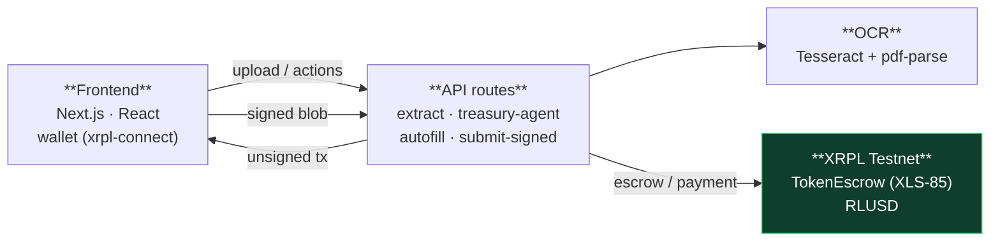

# TradeFlow AI

**Orchestrating agentic escrow, RLUSD settlement, and the XLS-85 standard to solve capital inefficiency.**

AI-powered institutional trade finance on XRPL. Suppliers upload invoices, AI extracts
and validates the trade data, a policy-controlled Treasury Agent approves it, and funds
move through a deterministic on-chain escrow — settling in RLUSD on the XRPL.

> Built at **SwissHacks (Zurich, 19–21 June 2026)** for Ripple's *Future of Finance on XRPL* challenge.
> Team **Go on or give up**: Erandi Abigail Ramírez Muñoz · Jesús Sebastián Jaime Oviedo · Mushtaq Bokhari · Usman Khan · Elias Sheikh.

---

## The Problem

Cross-border trade finance leaks capital and trust at every step:

| | |
|---|---|
| **The Idle Capital Trap** | An estimated ~$10T sits idle in slow, manual settlement pipelines instead of working capital. |
| **FX Slippage Blindspot** | Payments execute at arbitrary times, eating margin in low-liquidity windows. |
| **ERP Disconnect** | Treasury systems and trade documents live apart, so approvals are manual and error-prone. |

## The Solution — Context-Aware Agentic Escrow on XRPL

TradeFlow AI sits between the supplier's invoice and the buyer's treasury, automating
the path from document to settlement:

- **Deterministic TokenEscrow** — secures funds using XRPL's native **XLS-85** standard.
- **AI Invoice Intelligence** — OCR + parsing extract and validate trade data across documents.
- **Time-Zone & Liquidity Oracle** — schedules execution into high-liquidity windows to minimize FX slippage.
- **Institutional Guardrails** — an autonomous Treasury Agent enforces spend caps and supplier whitelists before any funds move.

---

## How It Works

```text
1. Supplier Upload        Supplier uploads invoice / PO / shipping docs
            ↓
2. Data Extraction        AI (OCR + parser) extracts and validates trade data
            ↓
3. Treasury Validation     Treasury Agent verifies policies (spend cap, whitelist)
            ↓
4. Escrow Creation        Funds locked in an XLS-85 TokenEscrow
            ↓
5. Delivery Confirmation   Shipment / delivery confirmed
            ↓
6. Final Release          Escrow released → supplier paid in RLUSD
```

See the full target-architecture diagrams in [docs/architecture.md](docs/architecture.md)
and [docs/flowchart.md](docs/flowchart.md).

---

## Architecture (as built)

How the current codebase actually fits together — a Next.js app whose API routes
talk to the XRPL Testnet, with transactions signed client-side by the user's wallet.



**Notes on the current build:**
- The **Treasury Agent** is a deterministic policy check (`amount < 50,000 && supplierApproved`) — the KYA/Credentials (XLS-70/80) guardrails in [docs/architecture.md](docs/architecture.md) are target design, not yet wired on-chain.
- **Signing happens client-side**: the backend autofills an unsigned transaction, the wallet signs it, and `/api/submit-signed` relays the blob — the server never holds keys.
- Document intelligence is **OCR + PDF text extraction** today; LLM cross-document validation is the next step.

---

## Tech Stack

- **Framework:** Next.js 15 (App Router) · React 19
- **Styling:** Tailwind CSS · DaisyUI
- **Ledger:** XRPL (`xrpl`, `xrpl-connect`) on the **XRPL Testnet**
- **AI / Document parsing:** Tesseract.js (OCR) · `pdf-parse`
- **Settlement asset:** RLUSD (issued currency)

---

## Getting Started

```bash
npm install
npm run dev
```

Open [http://localhost:3000](http://localhost:3000).

### Environment Variables

Create a `.env` file in the project root:

```env
NEXT_PUBLIC_CLIENT=wss://s.altnet.rippletest.net:51233
NEXT_PUBLIC_EXPLORER_NETWORK=testnet
NEXT_PUBLIC_XAMAN_API_KEY=""
```

---

## API Endpoints

All endpoints live under `app/api/*`.

### Wallet & connection
```http
GET  /api/connect                  Connect to the XRPL node
POST /api/generate-wallet          Generate & fund a testnet wallet
POST /api/account-info             Fetch account balances / details
POST /api/transaction-history      List account transactions
```

### Trade & treasury
```http
POST /api/extract-invoice          OCR + parse uploaded invoice/PO documents
POST /api/create-trade             Create a trade record
POST /api/trade-state              Read / update trade state
POST /api/treasury-agent           Run policy checks (spend cap + supplier whitelist)
```

### Settlement (XRPL)
```http
POST /api/setup-trustline          Establish an RLUSD trustline
POST /api/autofill-tx              Autofill an unsigned transaction
POST /api/submit-signed            Submit a client-signed transaction blob
POST /api/create-escrow            Create an XLS-85 TokenEscrow
POST /api/release-escrow           Release / finish an escrow
POST /api/create-payment           Send a direct payment
POST /api/create-check             Create an XRPL Check
POST /api/cash-check               Cash an XRPL Check
POST /api/mint-ticket              Mint a Ticket
```

### Treasury Agent policy

The Treasury Agent is the autonomous guardrail that gates settlement:

```text
IF   Supplier Approved
AND  Amount < 50,000 USD
THEN Automatically Create Escrow
ELSE Manual Approval Required
```

---

## Project Status

**Completed**
- ✅ XRPL Testnet connection, wallet generation, and basic transfers operational
- ✅ Invoice OCR / extraction pipeline
- ✅ Treasury Agent policy checks

**Next Phase**
- ⬜ Full EscrowCreate / EscrowFinish flow on RLUSD
- ⬜ Harden Treasury Agent rules (KYA/KYC, Credentials XLS-70 / Permissioned Domains XLS-80)

**Scaling & Global Reach**
- ⬜ Launch the trade dashboard and full RLUSD settlement
- ⬜ Expansion to multinational treasuries and logistics hubs

> ⚠️ **Note:** End-to-end RLUSD escrow on testnet is gated on the RLUSD issuer's
> ledger flag — see the team's notes before demoing live settlement.

---

## Strategic Value to Ripple

| XLS-85 | RLUSD | Agents |
|--------|-------|--------|
| Showcases the new escrow protocol standard | Real settlement utility for the native stablecoin | A flagship use case for autonomous on-chain finance |

---

## Business Model

- **Tiered Enterprise SaaS** — flat monthly fee based on invoice volume and number of deployed autonomous agents.
- **Optimization Fee (shared savings)** — a basis-point micro-fee on FX savings, collected via XRPL's native `ManagementFeeRate` architecture.

**Target customers:** mid-market import/export firms · multinational corporate treasuries · supply-chain logisticians.

---

## Repository Layout

```text
app/
  api/            Next.js API routes (wallet, trade, escrow, treasury agent)
  components/     UI (Dashboard, TradeWorkflow, wallet, charts)
  context/        WalletContext, RoleContext
  config/         asset definitions
docs/
  architecture.md                          Software architecture
  flowchart.md                             Business & process flows
  TradeFlow-AI-Investor-Pitch-Deck.pptx    Investor pitch deck
proj.md           Challenge brief
research/         Treasury Agent research & reference repos
```

---

## Reference

XRPL stores XRP as **drops** — `1 XRP = 1,000,000 drops`.
`EscrowCreate` reserves funds · `EscrowFinish` releases them.
