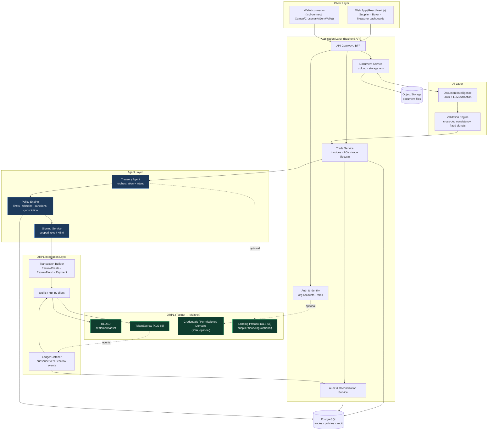
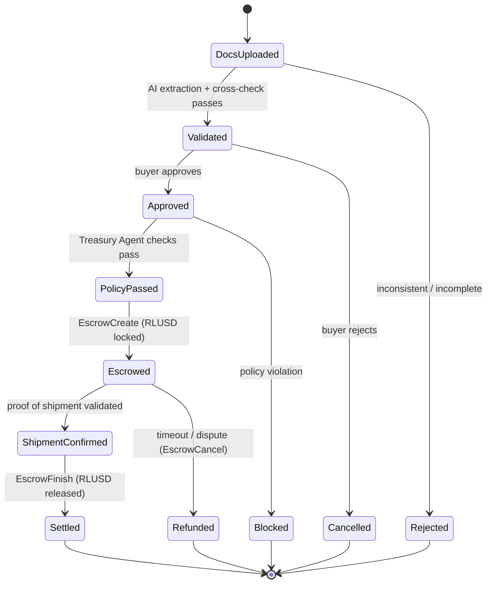
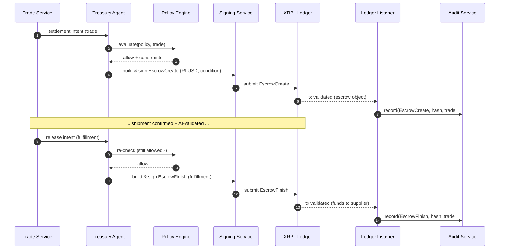
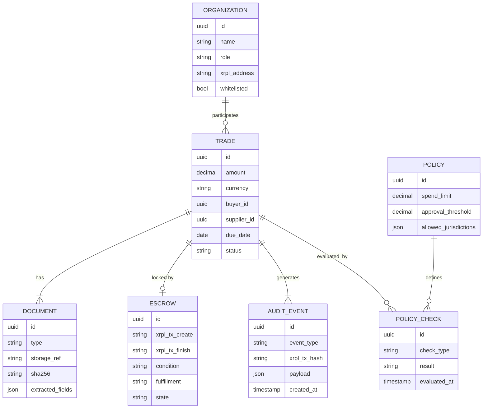

# TradeFlow AI — Software Architecture

**Cross-border trade settlement using RLUSD, TokenEscrow, and AI-driven document
validation, orchestrated by a policy-controlled Treasury Agent on XRPL.**

This document describes the system architecture: layers, components, data flow,
the escrow state machine, on-chain transactions, and how each piece maps to the
SwissHacks "Future of Finance on XRPL" challenge pillars.

Companion doc: [flowchart.md](flowchart.md) (business & process flows).

---

## 1. Architectural principles

1. **On-chain is the source of truth for value.** Escrow state and settlement
   live on XRPL; the backend never custodies funds — it only orchestrates.
2. **The agent has intent, the ledger has authority.** The Treasury Agent
   decides *whether* to transact; guardrails are enforced before any signed
   transaction reaches the ledger.
3. **AI is advisory, not custodial.** AI extracts and validates documents and
   proposes actions; it never holds keys or moves money directly.
4. **Every decision is auditable.** Each policy check, approval, and on-chain
   action is written to an immutable audit log keyed to the ledger transaction.
5. **Testnet-first, Mainnet-credible.** Build on XRPL Testnet/Devnet with a
   clean path to Mainnet (RLUSD + TokenEscrow are Mainnet-available).

---

## 2. System architecture (layered)

---

## 3. Component responsibilities

| Component | Responsibility | Notes |
| --- | --- | --- |
| **Web App** | Role-based dashboards for supplier, buyer, treasurer | Upload docs, approve trades, view escrow status |
| **Wallet connector** | Connect institutional XRPL wallets | `xrpl-connect` (Xaman, Crossmark, GemWallet, WalletConnect) |
| **API Gateway / BFF** | Single entry point, auth, request routing | Thin orchestration layer |
| **Trade Service** | Owns the trade lifecycle state machine | Coordinates AI, agent, and ledger steps |
| **Document Service** | Handle uploads, store file refs, hash docs | Document hashes can be anchored on-chain |
| **Document Intelligence** | OCR + LLM extraction of structured fields | Invoice amount, buyer, supplier, due date |
| **Validation Engine** | Cross-document consistency & fraud signals | Invoice vs PO vs shipping doc reconciliation |
| **Treasury Agent** | Autonomous orchestration of settlement intent | The on-chain action executor |
| **Policy Engine** | Enforce guardrails before signing | Limits, whitelist, sanctions, jurisdiction, thresholds |
| **Signing Service** | Hold scoped keys, sign transactions | HSM/KMS in production; never exposed to AI layer |
| **Transaction Builder** | Construct XRPL transactions | `EscrowCreate`, `EscrowFinish`, `Payment` |
| **Ledger Listener** | Subscribe to ledger/escrow events | Drives state transitions + audit records |
| **Audit Service** | Immutable log + reconciliation | Each entry references the on-chain tx hash |

---

## 4. Trade lifecycle — state machine

---

## 5. On-chain transaction sequence

The two settlement-critical, autonomously-executed transactions are
`EscrowCreate` and `EscrowFinish`. `EscrowCancel` covers the timeout/dispute
path.

---

## 6. Data model (core entities)

---

## 7. Suggested tech stack

| Layer | Choice | Rationale |
| --- | --- | --- |
| Frontend | React / Next.js + Tailwind | Fast institutional dashboards |
| Wallet | `xrpl-connect` | Multi-wallet XRPL support |
| Backend | Node.js (NestJS) or Python (FastAPI) | Pairs with `xrpl.js` / `xrpl-py` |
| AI | LLM document extraction + rules engine | Structured field extraction + validation |
| Agent | Policy engine + scoped signer | Optionally x402 for agent payment flows |
| XRPL SDK | `xrpl.js` (TS) or `xrpl-py` | TokenEscrow + RLUSD transactions |
| Persistence | PostgreSQL + object storage | Trades, policies, audit, document files |
| Settlement asset | RLUSD | Stable, programmable, Mainnet-ready |

---

## 8. XRPL feature usage (for judging)

| Feature / Amendment | Used for | Status |
| --- | --- | --- |
| **RLUSD** | Settlement asset locked & released | Mainnet / Testnet |
| **TokenEscrow (XLS-85)** | Conditional fund lock & release | Mainnet / Testnet / Devnet |
| **XRPL transactions** | `EscrowCreate`, `EscrowFinish`, `EscrowCancel`, `Payment` | Core |
| **Agent infrastructure** | Autonomous policy-gated on-chain execution | x402 optional |
| **Credentials / Permissioned Domains** | KYA — verified counterparties (optional) | Devnet |
| **Lending Protocol (XLS-66)** | Supplier early-financing of receivables (optional) | Devnet |

**Mapping to challenge pillars:**

- **Payments & FX** ✅ — cross-border settlement in RLUSD, programmable invoice logic, auto-reconciliation.
- **Credit & Lending** ✅ (optional) — tokenized receivables financing via XLS-66.
- **Agent Financial Infrastructure** ✅ — Treasury Agent executes on-chain transactions inside institutional guardrails (spending limits, policy enforcement, compliance checks, audit trails).

---

## 9. Path to Mainnet

1. **Now (hackathon):** XRPL Testnet/Devnet, real `EscrowCreate`/`EscrowFinish`
   with RLUSD, AI extraction on sample trade docs, policy engine + audit log.
2. **Hardening:** move signing into HSM/KMS, formal sanctions/KYC providers,
   Credentials-based KYA for counterparties.
3. **Mainnet:** RLUSD + TokenEscrow are Mainnet-available; add lending (XLS-66)
   for supplier financing once it graduates from Devnet.
