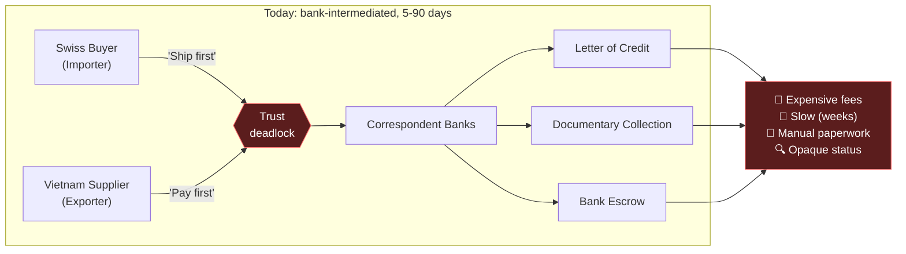
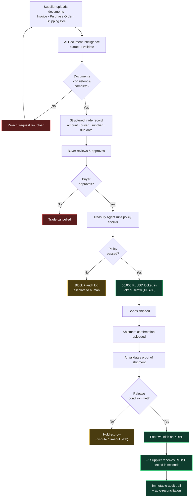
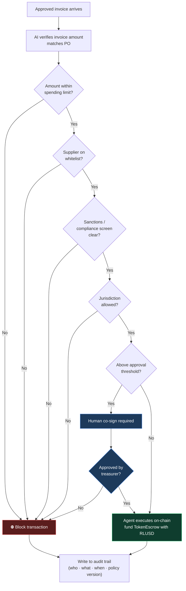
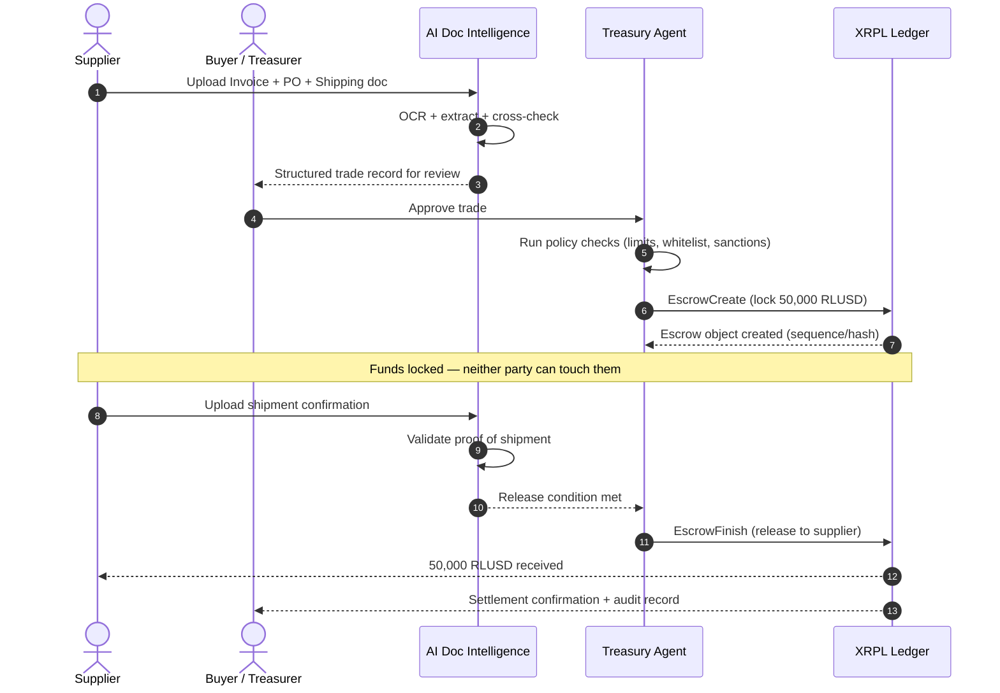

# TradeFlow AI — Process Flowcharts

**AI-powered institutional trade finance on XRPL**

Cross-border trade settlement using **RLUSD**, **TokenEscrow (XLS-85)**, and
**AI-driven document validation**, orchestrated by a policy-controlled
**Treasury Agent**.

> These diagrams render automatically on GitHub. For local preview use any
> Mermaid-compatible viewer (VS Code "Markdown Preview Mermaid Support", etc.).

---

## 1. The pain point — trade finance today

A Swiss buyer and a Vietnamese supplier face a deadlock: the buyer wants the
goods shipped first, the supplier wants to be paid first. Banks bridge that gap
with Letters of Credit, documentary collections, and escrow — but those are
expensive, slow, and paperwork-heavy.

---

## 2. TradeFlow AI — end-to-end settlement flow

The same trade, settled programmatically. Documents are validated by AI, funds
are locked in an on-chain **TokenEscrow**, and release is triggered
automatically once shipment is confirmed — no correspondent banks, settlement
in seconds.

---

## 3. Treasury Agent — policy decision flow

The "killer upgrade": an autonomous, policy-controlled agent sits between
**payment intent** and **settled transaction**. This is what lets TradeFlow AI
hit the Agent Financial Infrastructure pillar — at least one on-chain
transaction executed autonomously, inside institutional guardrails.

---

## 4. Escrow lifecycle — sequence view

End-to-end interaction across the supplier, buyer, AI layer, Treasury Agent, and
the XRPL ledger. The two on-chain transactions that matter for judging are
`EscrowCreate` (funding) and `EscrowFinish` (release).

---

## 5. Where each step maps to the challenge

| Flow step | XRPL feature / pillar |
| --- | --- |
| Document upload + extraction | AI Document Intelligence (Creativity) |
| Policy checks before payment | Agent Financial Infrastructure |
| Lock funds | TokenEscrow (XLS-85) + RLUSD |
| Cross-border settlement | Payments & FX |
| Release on shipment proof | Programmable invoice logic |
| Audit trail | Institutional guardrails / compliance |
| (Optional) supplier financing | Lending Protocol (XLS-66) |

See [architecture.md](architecture.md) for the system design behind these flows.
